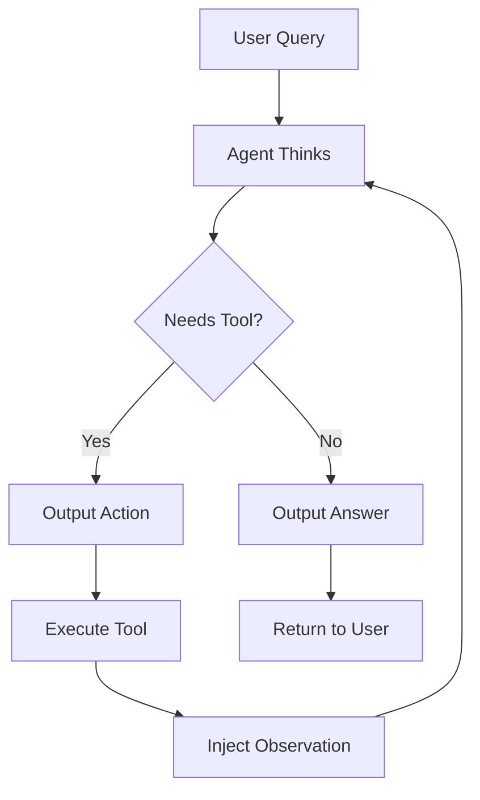

# 🤖 ReAct Agent from Scratch

A step-by-step implementation of a ReAct (Reasoning + Acting) agent using pure Python and OpenAI's API - no frameworks, just fundamental understanding.

## 🎯 What is This?

This project builds a ReAct agent from scratch to understand how AI agents actually work under the hood. ReAct is a pattern where an AI agent:
1. **Thinks** about what to do (Reasoning)
2. **Does** something (Acting)
3. **Observes** the result
4. **Thinks** again based on what it learned
5. Repeats until it solves the problem

## 🚀 Features

- **Pure Python Implementation** - No frameworks, no magic
- **Real Web Search** - Integrates with Brave Search API for current information
- **Transparent Reasoning** - See exactly how the agent thinks
- **Educational Structure** - Two steps that build on each other
- **Interactive CLI** - Test the agent with your own queries

## 📚 Learning Journey

### Step 1: Basic Reasoning (`step1_basic_agent.py`)
- Teaches LLM to follow a structured format
- Implements basic thought → answer pattern
- Parses structured output from free text

### Step 2: Adding Actions (`step2_with_tools.py`)
- Adds web search capability
- Implements the full ReAct loop
- Uses stop-and-wait pattern for real tool integration

## 🛠️ Setup

### Prerequisites
- Python 3.11
- OpenAI API key
- Brave Search API key (free tier available)

### Installation

1. **Clone the repository**
```bash
git clone https://github.com/yourusername/react-agent-from-scratch.git
cd react-agent-from-scratch
```

2. **Create virtual environment**
```bash
python -m venv venv
source venv/bin/activate  # On Windows: venv\Scripts\activate
```

3. **Install dependencies**
```bash
pip install -r requirements.txt
```

4. **Set up environment variables**

Create a `.env` file in the project root:
```env
OPENAI_API_KEY=your_openai_api_key_here
BRAVE_SEARCH_API_KEY=your_brave_search_api_key_here
```

### Getting API Keys

- **OpenAI API**: Sign up at [platform.openai.com](https://platform.openai.com)
- **Brave Search API**: Get free API key at [brave.com/search/api](https://brave.com/search/api/) (2000 searches/month free)

## 🎮 Usage

### Step 1: Basic Agent
```bash
python step1_basic_agent.py
```

Example interaction:
```
🧑 You: Why is the sky blue?

💭 Thought: The user is asking about the scientific reason behind the sky's blue color.
💡 Answer: The sky appears blue due to Rayleigh scattering...
```

### Step 2: Agent with Web Search
```bash
python step2_with_tools.py
```

Example interaction:
```
🧑 You: What's the weather in Tokyo today?

🤖 Step 1:
Thought: I need to search for current weather information in Tokyo.
Action: web_search("Tokyo weather today")

🔍 Searching: 'Tokyo weather today'...

📊 Results found:
1. Tokyo Weather - Current Conditions
   Tokyo: 22°C, Partly cloudy, Humidity: 65%...

🤖 Step 2:
Thought: Based on the search results, I can see Tokyo's current weather.
Answer: The weather in Tokyo is currently 22°C with partly cloudy skies and 65% humidity.
```

## 🧠 Key Concepts Learned

### 1. **LLMs Don't Actually "Call" Functions**
```python
# LLM outputs text:
"Action: web_search('Tokyo weather')"

# We parse and execute:
tool_name = "web_search"
parameter = "Tokyo weather"
result = web_search(parameter)
```

### 2. **The Stop-and-Wait Pattern**
Instead of generating everything at once, the agent:
- Outputs action and STOPS
- Waits for observation
- Continues with the result

### 3. **The ReAct Loop**
```python
while not has_answer:
    thought = llm.think()
    if needs_action:
        action = parse_action(thought)
        observation = execute(action)
        inject_observation(observation)
    else:
        answer = extract_answer(thought)
```

## 📂 Project Structure

```
react-agent-from-scratch/
├── .env                      # API keys (create this)
├── .gitignore               # Excludes .env and venv
├── requirements.txt         # Python dependencies
├── README.md               # This file
├── step1_basic_agent.py    # Basic reasoning agent
└── step2_with_tools.py     # Full ReAct agent with web search
```

## 📦 Dependencies

```txt
openai>=1.0.0
python-dotenv
requests
```

## 🎯 Example Queries to Try

**Queries that need search:**
- "What's the current Bitcoin price?"
- "Who won yesterday's Lakers game?"
- "What's the weather in Paris?"
- "Latest news about AI"

**Queries that don't need search:**
- "What is 15% of 2000?"
- "Explain quantum computing simply"
- "Write a haiku about programming"
- "What causes rainbows?"

## 💡 What I Learned

Building this project taught me:

1. **Agents are simpler than they seem** - It's just text parsing and function execution
2. **Prompting is programming** - The system prompt is essentially the agent's source code
3. **The loop is the magic** - The iterative reasoning process is what makes agents powerful
4. **Tools are just functions** - Any Python function can become a tool
5. **Observation injection is key** - Real data prevents hallucination

## 🔄 How the ReAct Pattern Works



## 🚦 Troubleshooting

**Issue**: "API key not found"
- **Solution**: Make sure `.env` file exists with your keys

**Issue**: "Search returns no results"
- **Solution**: Check your Brave API key is valid and has remaining quota

**Issue**: Agent keeps looping
- **Solution**: Maximum iterations prevent infinite loops (set to 3)

## 🎓 Educational Value

This project is perfect for:
- Understanding how AI agents really work
- Learning prompt engineering
- Seeing LLM tool use demystified
- Building foundation for more complex agents

## 📈 Next Steps

After mastering this single-tool agent, you can:
1. Add more tools (calculator, weather API, etc.)
2. Implement tool selection logic
3. Add memory/conversation history
4. Build specialized agents for specific tasks
5. Explore frameworks like LangChain/AutoGen with deep understanding

## 🤝 Contributing

Feel free to open issues or submit PRs if you find bugs or have improvements!

## 📜 License

MIT License - Use this code however you want!

## 🙏 Acknowledgments

- OpenAI for GPT models
- Brave for their search API
- The ReAct paper authors for the pattern

---

**Built with curiosity and byte-sized learning 🚀**

*If this helped you understand agents better, give it a ⭐!*
